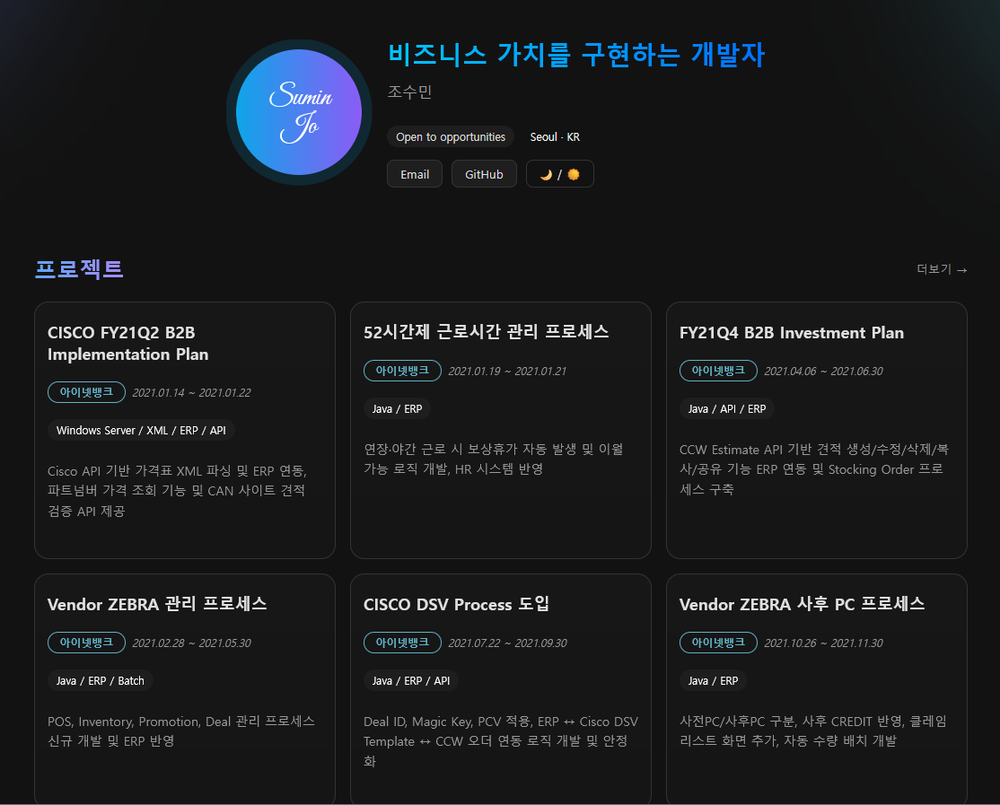

# 포트폴리오

> **바로 보기:** **https://sumin-jo.github.io/**  
> 깃허브 Pages로 배포된 개인 포트폴리오 사이트입니다.  
> React + Vite 기반이며, 프로젝트 데이터는 Supabase에서 가져옵니다.  
> 다크모드, 화이트모드 지원

---

## 미리보기

> 

---

## 기술 스택

- **Frontend**: React 18, Vite, React Router (HashRouter)
- **Styling**: 커스텀 CSS (다크·글래스·애니메이션), IntersectionObserver 리빌 효과
- **Data**: Supabase
- **CI/CD**: GitHub Pages

---

##  배포 (GitHub Pages)

**사용자 페이지**(`sumin-jo.github.io`)라서 최상위 도메인으로 배포됩니다.

### A) gh-pages 브랜치로 배포
- 빌드 후 `dist`를 `gh-pages` 브랜치에 푸시
- 레포 **Settings → Pages**: **Deploy from a branch**, Branch=`gh-pages`, Folder=`/(root)`

### B) GitHub Actions로 자동 배포 

---

##  주요 기능

- 프로젝트 리스트 카드(글래스·그라데이션·호버 리프트)
- 스크롤 리빌 애니메이션(IntersectionObserver)
- 상세 페이지: 기간/스택/설명/성과 리스트
- 스켈레톤 로딩
- Supabase 연동(SELECT만 공개 정책)

---

## 👋 문의

- Email: suminjo725@gmail.com
- GitHub: https://github.com/sumin-Jo

---

##  Live

---

##  Tech Stack

---

##  License

